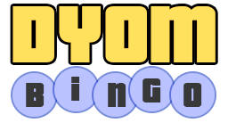

 

  
  
  

# What is DYOM Bingo?

Whether watching a livestream or playing DYOM on your own, the DYOM Bingo game provides a fun new experience where your challenge is to make a bingo out of the missions that come up from the DYOM Rainbomizer.

This game resembles a traditional Bingo game, but instead of numbers, you will have to mark the contents of the quadrants according to what occurs during your DYOM play. For example, if the mission starts at Grove Street, and you have the quadrant "Starts at Grove Street", you will mark this quadrant. And just like every Bingo game, the winner is the one who scores first 5 quadrants horizontally, vertically or diagonally.

# Join the game!

### [Click here to start DYOM Bingo](https://toriality.github.io/DYOM-Bingo/)

# Contributing

To start contributing to the project please check our [Contributing Guidelines](./.github/CONTRIBUTING.md)

## Contributors

<!-- ALL-CONTRIBUTORS-LIST:START - Do not remove or modify this section -->
<!-- prettier-ignore-start -->
<!-- markdownlint-disable -->

<!-- markdownlint-restore -->
<!-- prettier-ignore-end -->

<!-- ALL-CONTRIBUTORS-LIST:END -->
